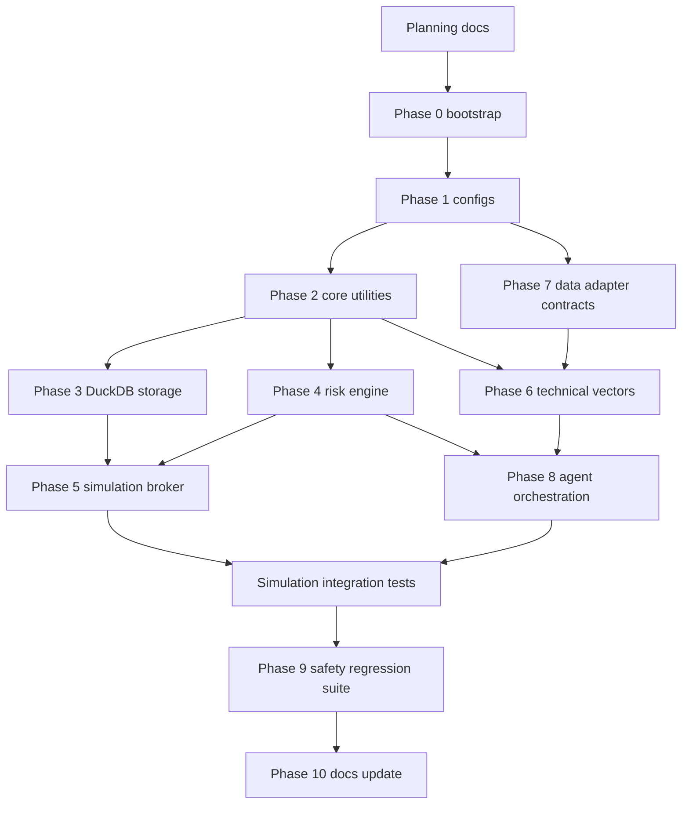

# Task Graph

## Critical Path



The safety-critical path is configs -> utilities -> risk engine -> simulation broker -> safety tests. Adapters and agents must not become a shortcut around that path.

## Module Dependencies

| Planned File or Group | Depends On | Blocks |
| --- | --- | --- |
| `config/settings.yaml` + `config/risk.yaml` | Bootstrap | Risk limits, broker defaults, adapter policies |
| `utils/clocks.py` | Bootstrap | Freshness validation |
| `utils/results.py` | Bootstrap | Shared `INSUFFICIENT_DATA` and reason semantics |
| `utils/toon.py` | Utility contracts | Safe agent payloads |
| `storage/schema.py` | DuckDB dependency, result contracts | Repositories and integration tests |
| `storage/repositories.py` | Storage schema | Audit trail, broker persistence |
| `data_pipeline/contracts.py` | Config and result contracts | Data validation, vectors, adapters |
| `data_pipeline/validation.py` | Data contracts, clocks | Technical vectors and risk data checks |
| `risk/anti_rug.py` | Risk models, validated evidence | Risk engine approval |
| `risk/engine.py` | Config limits, anti-rug, results | Simulation broker approval path |
| `execution/simulation_broker.py` | Risk approval model, portfolio model, storage | End-to-end paper flow |
| `technicals/vector_engine.py` | Validated snapshots, indicators | Agent research payloads |
| `agents/orchestrator.py` | Intent schema, vectors, TOON, risk interface | Bounded research loop |
| `onchain/goat_adapter.py` | Adapter contracts | Optional on-chain evidence |
| `data_pipeline/dexscreener_adapter.py` | Adapter contracts | Optional market evidence |
| `execution/testnet_boundary.py` | Risk engine and explicit later approval | Optional testnet research |

## Parallelizable Work

After bootstrap and settings contracts exist:

- Storage schema and risk model scaffolding can proceed in parallel if shared result contracts are stable.
- Data adapter contracts and technical indicator helpers can proceed in parallel.
- Safety tests can be drafted while risk and broker modules are implemented.
- Docs can evolve with accepted behavior after each phase.

## Blocked Tasks

| Task | Blocker |
| --- | --- |
| Simulated fills | Deterministic risk approval model |
| Agent orchestration | Intent schema, TOON boundary, vectors, risk interface |
| Concrete adapters | Normalization and failure contracts |
| Hummingbot MCP experiment | Simulation/testnet-only boundary and safety tests |
| Testnet execution boundary | Risk engine, mode validation, explicit design review |
| Any live order feature | Permanently blocked by safety rules |
| Withdrawal feature | Permanently blocked by safety rules |

## File Dependency Sketch

```text
config/settings.yaml + config/risk.yaml
  -> risk/limits.py
  -> execution/portfolio_state.py
  -> data_pipeline/source_registry.py

utils/results.py + utils/clocks.py
  -> data_pipeline/validation.py
  -> risk/engine.py
  -> technicals/vector_engine.py

data_pipeline/contracts.py
  -> data_pipeline/dexscreener_adapter.py
  -> onchain/goat_adapter.py
  -> technicals/vector_engine.py

risk/models.py + risk/anti_rug.py + risk/limits.py
  -> risk/engine.py
  -> execution/simulation_broker.py

technicals/vector_engine.py + utils/toon.py
  -> agents/llm_gateway.py
  -> agents/orchestrator.py
```
