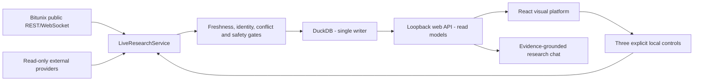
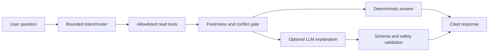

# TRAIDR Visual Platform Execution Plan

Audience: Luna implementation agent and TRAIDR maintainers

Plan date: 2026-08-03

Planning baseline: `d6caeda`

Target: a polished local SaaS-style visual platform with live public-market research, explainable scanner results, paper-futures views, operational health, and an evidence-grounded research chat.

Implementation status (2026-08-04): V0, V1, V2, bounded 15-second read-only snapshot polling, and the zero-weight intelligence-panel increment pass focused local checks. V3 market workspace through V6 certification remain pending. Provider readiness, derivatives regime, catalyst context, and exact shadow explanations are visible; full chart workspace, Ask TRAIDR UI, and certification remain pending.

This plan does not authorize live trading, private exchange endpoints, wallet access, signing, transfers, withdrawals, custody, or secret exposure.

## 1. Executive decision

Build a new browser application without replacing the Python research engine.

The chosen architecture is:

- Keep `LiveResearchService` as the only production writer and market-data authority.
- Add a loopback-only typed web API that reads DuckDB through existing query boundaries.
- Add a React/TypeScript single-page application for the SaaS-grade experience.
- Serve the production frontend from the local Python web process so the operator opens one URL.
- Keep Streamlit as a verified fallback until the new frontend reaches feature parity.

Do not connect the browser directly to Bitunix, CoinGlass, CoinGecko, CoinMarketCap, DuckDB, an LLM, or any exchange action. The browser consumes only TRAIDR's validated local API.

## 2. Product definition

The visual platform must answer four questions immediately:

1. Is the system healthy and is the displayed data genuinely fresh?
2. Which markets deserve research attention, and why?
3. Why did TRAIDR return `LONG`, `SHORT`, `NO_TRADE`, or `INSUFFICIENT_DATA`?
4. What is happening in the local paper portfolio and risk state?

The research chat adds a fifth capability: ask natural-language questions about current local evidence and receive timestamped, cited, non-executing answers.

This is not an order terminal. It contains no buy, sell, close, reverse, cancel, leverage, transfer, withdrawal, wallet, or exchange-credential controls.

## 3. Current repository reality

Reuse these implemented components:

| Existing capability | Current files | Adoption decision |
| --- | --- | --- |
| Visual command center | `dashboard/app.py`, `dashboard/components/__init__.py` | Preserve information hierarchy and safety language |
| Interactive chart | `dashboard/bitunix_cockpit.py`, `dashboard/components/chart_engine.js` | Wrap and reuse before considering replacement |
| Live scanner view | `dashboard/pages/live_scanner.py` | Replace table-first presentation with scanner cards and drill-down |
| Read-only data aggregation | `dashboard/queries.py` | Extract reusable query/read-model services; do not duplicate SQL in frontend |
| Single-writer service | `scheduler/live_service.py` | Remains the only production writer |
| Loopback controls | `scheduler/control_api.py`, `dashboard/actions.py` | Preserve exact allowlist: refresh, paper enable, paper disable |
| Local Ask TRAIDR | `ask/local_answerer.py`, `ask/intents.py`, `ask/query_parser.py` | Reuse as deterministic chat fallback and expand with typed evidence |
| Safety and certification | `SAFETY_RULES.md`, `docs/PRODUCTION_CERTIFICATION.md` | Treat as hard release gates |

What remains:

- The React/TypeScript V2 shell now provides the Command Center, Scanner, responsive navigation, explicit preview state, and a guarded read-only API client.
- Ask TRAIDR is CLI-only and is not connected to a visual chat surface.
- The React shell does not yet have market workspace, paper portfolio, operations, audit, or research-chat parity with Streamlit.
- Bounded live snapshot polling is implemented; chart integration and citation-ready research responses remain V3-V5 work.
- Streamlit remains the verified fallback until parity and release gates pass.

## 4. Safety invariants

Every visual-platform component must preserve these invariants:

- Bind local services to `127.0.0.1` by default and reject non-loopback binding in production mode.
- Every research response includes `can_execute_trades: false`.
- Missing, stale, malformed, contradictory, unmapped, or unsafe evidence returns `HOLD`, `NO_TRADE`, or `INSUFFICIENT_DATA`.
- The browser never receives provider keys, process environment dumps, raw secrets, or unrestricted SQL access.
- Chat output cannot create scores, probabilities, risk approvals, orders, paper fills, or control requests.

The only allowed state-changing UI actions remain:

1. Refresh research data.
2. Enable deterministic local paper simulation.
3. Disable deterministic local paper simulation.

These actions must use explicit routes, origin checks, payload limits, audit records, and the existing service allowlist. Do not create a generic action endpoint.

## 5. Target system architecture



Runtime processes:

| Process | Responsibility | Network boundary |
| --- | --- | --- |
| Research service | Collect, normalize, score, persist, paper-simulate | Public providers out; loopback controls in |
| Visual web process | Serve static frontend and typed read API | Loopback only |
| Browser | Render data, charts, chat, and explicit local controls | Connects only to visual web process |

The production frontend is compiled to static assets and served by the local Python web process. Node.js is required for development/build, not for normal packaged runtime operation.

## 6. Technology choice

### Backend web layer

- Python 3.11.
- FastAPI with Pydantic contracts and Uvicorn, pinned in the project lock.
- Existing `dashboard.queries` and new read-model services as the data source.
- Short-lived read-only DuckDB connections using bounded, parameterized queries.
- Server-Sent Events after snapshot polling is stable; no direct provider stream reaches the browser.

### Frontend

- React and TypeScript with Vite.
- A small, explicit component system using accessible primitives.
- TanStack Query or an equivalent query cache for polling, retries, and stale-state handling.
- The existing chart engine wrapped as a React component for the first parity release.
- Bundled assets only; no CDN runtime dependency.

### Visual direction

Preserve TRAIDR's existing dark command-center identity:

- Deep navy/black surfaces, high-contrast text, cyan research accent.
- Green only for confirmed healthy/positive states; red for risk/failure; amber for stale/degraded.
- Dense but calm information hierarchy, similar to professional market terminals rather than a marketing landing page.
- Typography, spacing, radii, shadows, and state colors become shared tokens.
- Motion is limited to data updates, focus transitions, drawers, and status changes.

AIDesigner may be used for a visual reference only after explicit user approval. Generated HTML is never pasted into the application; it must be translated into repo-native components and tokens.

## 7. Information architecture

### Primary navigation

| Route | Purpose | Main content |
| --- | --- | --- |
| `/` | Command Center | Health strip, market regime, top risks, scanner leaders, alerts, paper summary |
| `/scanner` | Live Scanner | Ranked candidates, filters, exact factors, conflicts, freshness, risk/reward |
| `/markets/:instrumentId` | Market Workspace | Chart, order book, trade flow, funding/OI, liquidations, news, evidence timeline |
| `/research` | Ask TRAIDR | Research chat, suggested prompts, citations, linked market/context cards |
| `/paper` | Paper Futures | Portfolio, positions, fills, fees, funding, liquidation distance, stress, drawdown |
| `/operations` | Operations | Providers, heartbeats, gaps, circuits, backups, controls, certification progress |
| `/audit` | Audit | Decision changes, evidence versions, reason codes, replay/calibration artifacts |

### Global shell

- Left navigation with product identity and current environment.
- Top status bar with database, service, feed freshness, paper-mode, and certification state.
- Global instrument search restricted to reviewed/local instruments.
- Persistent `Research only` and `can_execute_trades: false` status.
- Responsive drawer navigation below desktop width.

Do not show a green `LIVE` badge unless the latest required channels are inside configured freshness thresholds. Use `DEGRADED`, `STALE`, `OFFLINE`, or `INSUFFICIENT_DATA` truthfully.

## 8. Screen specifications

### 8.1 Command Center

Required sections:

- System status strip with `as_of`, provider health, database, service heartbeat, and paper mode.
- Risk-first market summary: safety warnings and data conflicts appear before opportunity cards.
- Top scanner candidates with direction, score state, freshness, risk score, and the three strongest factors.
- BTC/ETH market context with funding, OI, liquidation pressure, and correlation state.
- Paper portfolio summary and recent decision/alert timeline.

Acceptance:

- First useful state renders from one aggregate API call.
- Every card has timestamp, source status, empty state, and drill-down route.
- Stale or conflicting records cannot retain a directional opportunity treatment.
- Preview data is visibly watermarked and never mixed with `live_public` data.

### 8.2 Live Scanner

Required behavior:

- Sort by research score, risk, freshness, liquidity, instrument, and update time.
- Filter by `LONG`, `SHORT`, `NO_TRADE`, `INSUFFICIENT_DATA`, provider state, and watchlist.
- Expand a candidate to show all ten raw values, normalization, weights, contributions, source, timestamp, and reason codes.
- Display source conflicts side-by-side instead of hiding the losing source.
- Link directly to the market workspace and prefill an Ask TRAIDR question.

Acceptance:

- A complete result shows exactly ten factors.
- Missing factors remain visible and contribute zero.
- Available factors keep their truthful raw values when another factor is missing.
- A stale required factor forces non-directional presentation.

### 8.3 Market Workspace

Required panels:

- Interactive candles, volume, support/resistance, fair-value gaps, signal brackets, paper fills, stops, targets, and liquidation levels.
- Order-book depth, spread, imbalance, and recent trade delta.
- Funding, basis, open interest, OI change, liquidation pressure, and long/short ratio.
- Evidence timeline for news, on-chain safety, provider health, identity, and decision changes.
- Explainability drawer containing score factors, vetoes, plan levels, expiry, and calibration state.

Acceptance:

- Chart payloads use validated API contracts and contain `can_execute_trades: false`.
- Interval/symbol changes cancel obsolete requests and cannot mix instruments.
- Empty, loading, stale, malformed, gap, preview, and offline states have distinct UI treatments.
- No order ticket or exchange-action control exists.

### 8.4 Ask TRAIDR

The chat has two modes behind one contract:

1. Deterministic local mode: existing intent parser and local answerer, expanded to typed responses and citations.
2. Optional explanation mode: an approved LLM may summarize only sanitized, retrieved evidence and must fall back to deterministic output.

Supported question families:

- Top risks and research candidates.
- Why an instrument is `NO_TRADE` or `INSUFFICIENT_DATA`.
- Compare two reviewed instruments using synchronized evidence.
- Explain scanner factors, conflicts, freshness, paper exposure, alerts, and certification state.
- Summarize changes since a prior timestamp from stored audit evidence.

Chat rules:

- The model receives bounded read-only tool results, never direct DuckDB or provider access.
- Every answer has citations to local record identifiers/timestamps and a visible `as_of` time.
- If required evidence is stale or absent, the answer says so and does not complete the missing analysis.
- Unknown questions return safe suggestions; unsupported actions are explicitly refused.
- Chat history stays browser-session local in the first release and is not written to DuckDB.

### 8.5 Paper Futures

Required sections:

- Equity, free margin, used margin, unrealized/realized P&L, fees, funding, and drawdown.
- Position table with side, size, entry, mark, stop, targets, liquidation estimate, margin, P&L, and age.
- Fill/funding/order-event timeline and stress/correlation panels.
- Explicit paper-mode status and deterministic risk-veto history.

Acceptance:

- Every row is visibly marked `PAPER`.
- No visual element resembles a live exchange submit/close/reverse order control.
- Paper enable/disable controls require confirmation and use only the existing allowlisted service actions.
- Accounting totals match repository reconciliation outputs.

### 8.6 Operations and Audit

Required sections:

- Service heartbeat, channel freshness, provider latency/rate-limit/circuit state, gaps, reconnects, and coverage.
- Backup and restore evidence, disk/database status, schema version, replay hashes, calibration state, and certification timer.
- Exact allowlisted controls with result/audit status.
- Decision-change timeline and downloadable local JSON/CSV reports that contain no secrets.

Acceptance:

- Failures are actionable and include a safe next step.
- Certification elapsed time is never simulated or editable.
- Exports are generated from safe read models and pass secret-field filtering.
- Controls reject non-loopback origin, unknown action, large payload, and missing control header.

## 9. API contracts

Create versioned endpoints under `/api/v1`.

### Read endpoints

| Method and path | Response |
| --- | --- |
| `GET /status` | App, service, database, provider, freshness, paper, certification summary |
| `GET /overview` | Command-center aggregate read model |
| `GET /scanner` | Paginated/filterable scanner summaries |
| `GET /scanner/{instrument_id}` | Exact ten-factor breakdown and conflicts |
| `GET /markets` | Reviewed/local instruments and mapping states |
| `GET /markets/{instrument_id}` | Market workspace aggregate |
| `GET /markets/{instrument_id}/chart` | Interval-bound chart payload and overlays |
| `GET /paper` | Paper portfolio aggregate |
| `GET /operations` | Health, gaps, circuits, backups, models, certification |
| `GET /audit` | Paginated decision/evidence/audit changes |
| `GET /events` | Server-Sent Events for invalidation/status hints, not raw provider frames |

### Non-executing request endpoints

| Method and path | Allowed behavior |
| --- | --- |
| `POST /chat/query` | Read-only evidence retrieval and answer generation |
| `POST /controls/refresh` | Existing allowlisted research refresh |
| `POST /controls/paper/enable` | Existing deterministic paper-mode toggle |
| `POST /controls/paper/disable` | Existing deterministic paper-mode toggle |

Do not add a generic `/controls/{action}` route.

### Envelope contract

Every endpoint returns a shared envelope:

```json
{
  "status": "OK",
  "as_of": "2026-08-03T12:00:00Z",
  "data": {},
  "freshness": {},
  "reason_codes": [],
  "can_execute_trades": false,
  "request_id": "read-..."
}
```

Allowed top-level statuses are `OK`, `DEGRADED`, `NO_TRADE`, `INSUFFICIENT_DATA`, and `ERROR`. Validation errors must not leak stack traces, SQL, local secrets, or full environment paths.

### Chat response contract

```json
{
  "status": "INSUFFICIENT_DATA",
  "answer_markdown": "Open-interest evidence is stale, so TRAIDR cannot complete this comparison.",
  "intent": "compare_instruments",
  "as_of": "2026-08-03T12:00:00Z",
  "citations": [
    {
      "record_type": "market_scanner_score",
      "record_id": "scanner:bitunix:BTCUSDT:...",
      "observed_at": "2026-08-03T11:50:00Z",
      "label": "BTCUSDT scanner evidence"
    }
  ],
  "suggested_questions": [],
  "reason_codes": ["STALE_OPEN_INTEREST"],
  "can_execute_trades": false
}
```

## 10. Live-update model

Implement live behavior in two safe stages:

### Stage A - bounded polling

- Overview/status: every 3 seconds while visible.
- Scanner: every 5 seconds while visible.
- Market workspace: chart updates at the instrument/interval cadence; microstructure every 2 seconds.
- Operations: every 5 seconds; certification timer may update locally between server confirmations.
- Pause nonessential polling when the tab is hidden.

### Stage B - Server-Sent Events

- Send only event type, changed resource, instrument, version/as-of time, and health state.
- Browser invalidates the relevant cached GET query after an event.
- Do not stream raw trades, provider payloads, credentials, or database rows through SSE.
- Reconnect with bounded exponential backoff and show offline/stale state during disconnect.

The browser must never infer freshness from arrival time alone. It uses server-provided observation timestamps and thresholds.

## 11. Research-chat architecture



Read tools are fixed functions, not arbitrary SQL:

- `get_system_status`
- `list_scanner_candidates`
- `get_instrument_evidence`
- `compare_instruments`
- `get_paper_summary`
- `get_alerts_and_changes`
- `get_certification_status`

Optional LLM requirements:

- Provider adapter behind a protocol; deterministic local provider remains the default.
- Process-memory key only; no browser exposure and no key in DuckDB/logs/prompts returned to the user.
- TOON-safe or JSON-safe evidence payload with strict size, field, age, and source bounds.
- Temperature and prompt cannot override status, scores, probabilities, risk vetoes, or citations.
- Timeout, provider failure, schema failure, or unsupported question falls back to deterministic output.

## 12. File plan

### Python additions

```text
web_api/
  __init__.py
  app.py
  contracts.py
  dependencies.py
  read_models.py
  freshness.py
  chat_service.py
  controls.py
  events.py
  routes/
    status.py
    overview.py
    scanner.py
    markets.py
    paper.py
    operations.py
    audit.py
    chat.py
```

### Frontend additions

```text
web/
  package.json
  vite.config.ts
  tsconfig.json
  src/
    app/
    routes/
    components/
      layout/
      status/
      scanner/
      charts/
      evidence/
      chat/
      paper/
      operations/
    hooks/
    lib/
      api.ts
      contracts.ts
      freshness.ts
      format.ts
    styles/
      tokens.css
      globals.css
```

### Existing files to modify carefully

| File | Planned change |
| --- | --- |
| `dashboard/queries.py` | Extract reusable bounded read functions while keeping Streamlit compatibility |
| `ask/local_answerer.py` | Add typed answer model and citations without breaking CLI text output |
| `ask/intents.py` | Add instrument explanation/comparison/change intents |
| `ask/query_parser.py` | Parse new read-only intent families deterministically |
| `scheduler/control_api.py` | Keep allowlist unchanged; add origin/contract tests if needed |
| `cli/main.py`, `cli/commands.py` | Add `ui run` and `ui status` operator commands |
| `pyproject.toml`, `requirements.lock` | Add and pin web API dependencies |
| `docs/dashboard.md`, `README.md` | Document one-URL visual startup and fallback Streamlit path |

Do not modify scoring, risk, paper accounting, provider parsing, or certification logic merely to simplify frontend work.

## 13. Delivery phases

### V0 - Prerequisites and safety fixes

Estimate: 0.5-1 day after Python 3.11 is restored.

Tasks:

- Restore the locked Python 3.11 environment.
- Fix stale-observation acceptance, case-insensitive `Retry-After`, and unavailable-factor raw evidence.
- Record a new exact test/static-check baseline.
- Confirm the current Streamlit dashboard and Ask TRAIDR tests pass.

Exit gate: canonical Phase 1 passes. Visual implementation does not start on an unverified data contract.

### V1 - Contracts and read-model extraction

Estimate: 2-3 days.

Tasks:

- Define Pydantic API envelopes and domain read models.
- Extract parameterized read services from `dashboard.queries` without changing results.
- Build FastAPI app, loopback host validation, error envelopes, request IDs, and safe CORS/origin policy.
- Implement `/status`, `/overview`, `/scanner`, and market/chart endpoints.
- Add OpenAPI schema snapshot and contract tests.

Exit gate: API tests pass with missing, empty, healthy, stale, degraded, conflicting, and malformed fixture databases.

### V2 - Visual foundation

Estimate: 2-3 days.

Tasks:

- Scaffold React/TypeScript/Vite and lock dependencies.
- Define tokens, responsive shell, navigation, status bar, loading/empty/error components, and API client.
- Build Command Center and basic Scanner route from mocked contracts.
- Implement accessibility labels, keyboard navigation, focus states, and reduced-motion behavior.
- Capture desktop/tablet/mobile screenshots for review.

Exit gate: visual shell passes typecheck, unit tests, accessibility smoke, and screenshot review without live backend dependency.

### V3 - Live scanner and market workspace

Estimate: 3-5 days.

Tasks:

- Connect overview/scanner routes to the local API with bounded polling.
- Build filterable scanner cards and ten-factor drill-down.
- Wrap the existing chart engine in a lifecycle-safe React component.
- Add order flow, funding/OI/liquidation, evidence timeline, source conflicts, and explainability drawer.
- Implement instrument/interval cancellation and stale-state transitions.

Exit gate: Playwright proves live refresh, navigation, chart interaction, exact factors, stale veto, conflict veto, and no execution controls.

### V4 - Paper, operations, and audit

Estimate: 2-4 days.

Tasks:

- Implement paper portfolio, position, fill, funding, stress, and drawdown views.
- Implement provider health, gaps, circuits, backups, model/calibration, and certification views.
- Proxy only the three explicit local controls with confirmation and audit feedback.
- Add safe JSON/CSV export for read models.
- Verify accounting values against repository queries.

Exit gate: paper/operations UI matches stored truth, controls are allowlisted, and safety tests find no exchange-action surface.

### V5 - Visual Ask TRAIDR

Estimate: 3-5 days for deterministic chat; optional LLM provider is a separate reviewed increment.

Tasks:

- Convert local answer output to typed response/citation models while retaining CLI compatibility.
- Add explanation, comparison, change-summary, scanner, health, and paper question families.
- Build chat route, suggested prompts, source cards, answer status, and linked instrument navigation.
- Add prompt length, tool result, timeout, freshness, conflict, and unsupported-action guards.
- Add optional LLM adapter only after deterministic chat is fully tested.

Exit gate: every answer is cited, timestamped, status-aware, non-executing, and deterministic without an external LLM.

### V6 - Packaging and parity

Estimate: 2-4 days.

Tasks:

- Build frontend assets and serve them from the Python web process.
- Add `traidr ui run` with loopback-only default and clear service/database state.
- Add fallback routing, offline page, startup doctor, and port-conflict errors.
- Compare every current Streamlit capability against the parity checklist.
- Keep Streamlit documented and runnable until parity is signed off.

Exit gate: a clean Python 3.11 checkout can install, build, start, and open the platform at one loopback URL.

### V7 - Hardening and release evidence

Estimate: 3-5 days plus the existing 72-hour certification window.

Tasks:

- Run Python, frontend, browser, accessibility, performance, secret, and forbidden-capability suites.
- Test disconnects, database lock/errors, stale service, malformed API response, SSE reconnect, and provider degradation.
- Produce screenshot evidence for all primary routes and critical states.
- Run shadow certification with the visual platform observing the same release candidate.
- Require green GitHub Actions on the exact release SHA.

Exit gate: all visual definition-of-done and canonical release gates pass.

## 14. Test plan

### Backend/API

- Unit tests for envelopes, read models, freshness, reason codes, pagination, filters, and serialization.
- API tests for every route and status using fixture DuckDB databases.
- Contract tests proving all outputs include `as_of`, `reason_codes`, and `can_execute_trades: false`.
- Security tests for loopback binding, origin policy, payload limits, unknown controls, error redaction, and secret fields.
- Concurrency tests proving dashboard reads do not mutate storage or violate the single-writer boundary.

### Frontend

- TypeScript strict mode and lint.
- Component tests for loading, empty, healthy, stale, degraded, conflicting, preview, and offline states.
- Query tests for retry/backoff, cancellation, cache invalidation, hidden-tab polling, and stale labels.
- Accessibility tests for landmarks, labels, focus, keyboard operation, contrast, and reduced motion.
- Snapshot/screenshot tests for key layouts at desktop, tablet, and mobile widths.

### End-to-end

- Open platform with missing database and receive safe setup guidance.
- Start from fixture database and navigate every route without exceptions.
- Update stored scanner evidence and observe bounded live refresh.
- Ask why a result is `NO_TRADE` and receive exact cited reasons.
- Verify browser has no order, leverage, wallet, transfer, withdrawal, signing, or credential surface.

### Performance budgets

- Local API p95 under 250 ms for bounded overview/scanner requests on the certification-size database.
- First useful Command Center content under 2 seconds on the supported local machine after assets are cached.
- Visual update within 5 seconds of persisted scanner state during polling mode.
- Deterministic local chat response under 1 second for supported intents.
- No unbounded table query, browser list, payload, chat context, or retry loop.

## 15. Acceptance matrix

| Capability | Must pass before parity |
| --- | --- |
| Command Center | Risk-first summary, genuine freshness, drill-down links, responsive states |
| Scanner | Ten exact factors, truthful unavailable evidence, filters, stale/conflict vetoes |
| Market Workspace | Interactive chart, microstructure, derivatives, evidence, explanation |
| Ask TRAIDR | Cited local answers, timestamps, safe fallback, no action authority |
| Paper Futures | Reconciled state, explicit paper marking, no live-order affordance |
| Operations | Providers, gaps, backups, certification, three allowlisted controls |
| Audit | Decision/evidence changes, reason codes, safe exports |
| Packaging | One loopback URL, clean install/build/start, Streamlit fallback |

## 16. Luna execution protocol

Luna must work one phase at a time.

For each phase:

1. Read only the files listed for that phase plus direct dependencies discovered by targeted search.
2. Add or update tests before completing behavior changes.
3. Preserve existing reason codes, read-only contracts, and Streamlit fallback behavior.
4. Run focused checks, then the full applicable Python/frontend/browser gates.
5. Commit and push only a clean, verified scope; report exact files, tests, commit, and blockers.

Luna must stop and report if:

- A request requires a forbidden exchange/wallet/custody capability.
- Python 3.11 or locked dependencies cannot be reproduced.
- Existing user changes overlap the active files and cannot be safely separated.
- The API would need unrestricted SQL, remote binding, browser-visible secrets, or direct provider credentials.
- A directional UI would need stale, missing, contradictory, or fabricated evidence.

## 17. Luna starting prompt

Use this exact instruction for the first implementation task:

```text
Read IMPLEMENTATION_PLAN.md and docs/VISUAL_PLATFORM_EXECUTION_PLAN.md.
Execute only Phase V0, then Phase V1 if and only if V0 passes.
Inspect only the files named by those phases and direct dependencies found by targeted search.
Preserve the single-writer service, read-only dashboard boundary, deterministic safety vetoes, and Streamlit fallback.
Do not implement live trading, private exchange endpoints, order actions, leverage changes, wallets, signing, transfers, withdrawals, custody, unrestricted SQL, remote binding, or browser-visible secrets.
Add focused tests for every changed behavior. Run focused checks and the applicable full verification matrix.
Report PASS, FAIL, or BLOCKED; exact files and lines; tests; smallest safe follow-up; commit and push status.
```

## 18. Final definition of done

The visual platform is complete when:

- The operator can start TRAIDR and open one local browser URL without using terminal commands for normal research workflows.
- Live public data, scanner evidence, charts, paper state, health, audit, and research chat are integrated and visibly timestamped.
- Every stale, missing, conflicting, malformed, preview, offline, and unsafe state is presented truthfully.
- Research chat answers are grounded in local evidence with citations and no execution authority.
- Streamlit parity is proven before fallback removal is considered.
- All canonical verification, certification, safety, backup/restore, replay, CI, and release gates pass.

No visual polish, chat capability, model output, or user request may bypass the safety contract.
