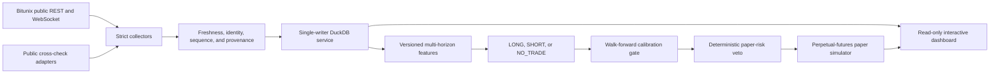

# Architecture

TRAIDR is a local simulation research engine with explicit boundaries between observations, model-assisted research, deterministic risk, and paper execution.

## Production Public-Research Flow

1. Strict endpoint models normalize public REST snapshots and WebSocket events into versioned contracts.
2. The service detects stale channels, duplicate/out-of-order events, gaps, reconnects, malformed frames, and identity ambiguity.
3. One service-owned DuckDB connection stores normalized candles, market events, health, features, signals, outcomes, models, controls, and paper state.
4. Multi-horizon features are calculated independently for 5-minute, 15-minute, 1-hour, 4-hour, and daily candles.
5. The signal engine produces explainable `LONG`, `SHORT`, or `NO_TRADE` decisions with brackets, costs, evidence, expiry, coverage, and vetoes.
6. Percentages remain nullable unless chronological out-of-sample calibration meets the sample, error, coverage, and quality gates.
7. The deterministic paper-risk gate is final. The perpetual-futures simulator adds margin, fees, funding, spread/slippage, stops, targets, liquidation estimates, and drawdown controls.
8. The dashboard uses read-only database connections and an allowlisted loopback service API for refresh and explicit paper toggles.

## Legacy MVP Flow

1. The data pipeline normalizes source or fixture records into `NormalizedMarketSnapshot` values with identity, metrics, provenance, and freshness fields.
2. The technical vector engine turns deterministic OHLCV candles into compact TOON-safe features.
3. On-chain helpers produce anti-rug evidence for deterministic veto checks.
4. The research agent receives a scrubbed TOON payload and returns a bounded intent through a mockable gateway.
5. `RiskEngine` evaluates data quality, freshness, anti-rug evidence, confidence, mode, bankroll, exposure, open positions, and daily loss.
6. `SimulationBroker` accepts only approved risk decisions and records paper orders, fills, and audit events in DuckDB.

## Boundaries

- Raw adapter payloads do not enter risk or execution directly.
- Raw LLM text is parsed into bounded intents before risk validation.
- No execution path exists for live exchange orders, withdrawals, custody, signing, or private-key access.
- DuckDB is local storage for research evidence, technical vectors, intents, risk decisions, paper records, and audit events.
- The live public service is the only production writer; dashboard connections are read-only.
- LLMs cannot create scores, probabilities, risk approvals, orders, or paper fills.

## Optional Sources

DexScreener and GOAT modules are safe adapter wrappers in this MVP. They are fixture-first, mockable, and must fail closed when input is missing, stale, contradictory, or uncertain.
